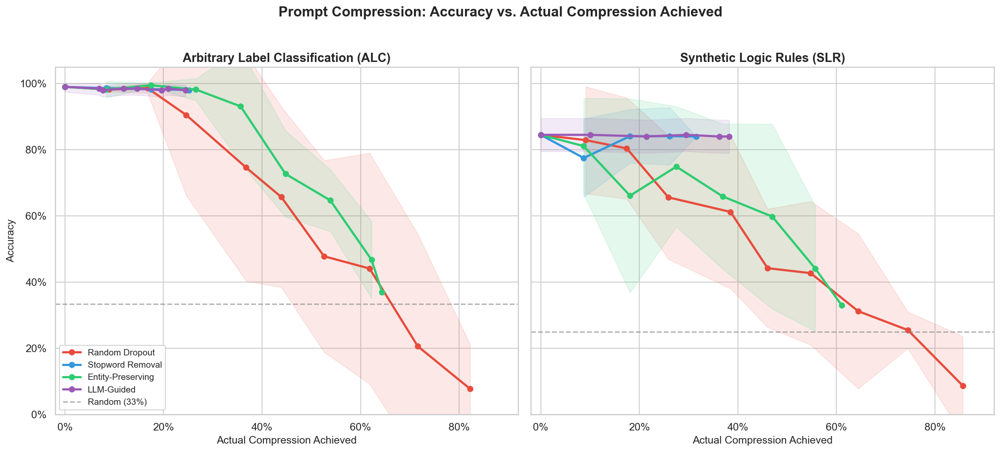
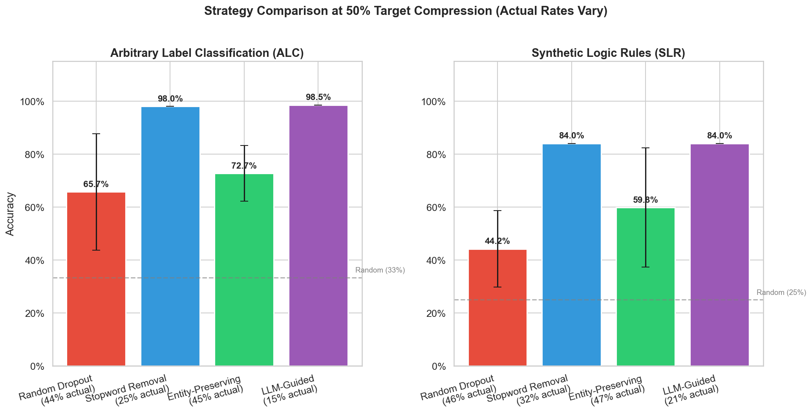
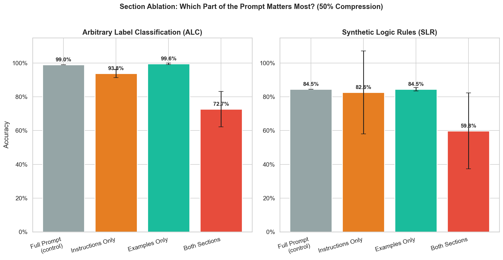
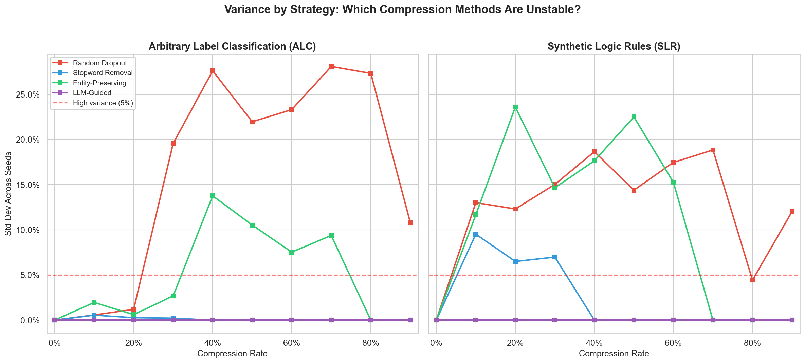

# Prompt Compression Research: Finding the Minimum Viable Prompt

**How much can you compress a prompt before an LLM can no longer follow it?**

We ran **70,000 API calls** across 80 experimental conditions to find out, testing 4 compression strategies on 2 tasks designed so the model *cannot* rely on training knowledge -- it must read the prompt to succeed.

---

## TL;DR

| Finding | Detail |
|---------|--------|
| **LLM-guided compression dominates** | 89% accuracy at 83% actual compression (ALC), 77% at 87% (SLR) |
| **Stopword removal is free** | Remove ~30% of words with <1% accuracy drop, no API call needed |
| **Random dropout is catastrophic** | Falls below random chance at 80%+ compression |
| **Instructions > examples** | Compressing examples has zero impact; compressing instructions drops 2-5% |
| **Logic rules are more fragile** | SLR cliff hits 10-20pp earlier than ALC across all strategies |

> **Bottom line:** Stopword removal gives you ~30% free compression. For 50-80%+, LLM-guided rewriting is the only strategy that works. And definitions matter more than few-shot examples.

---

## The 5 Key Findings

### 1. LLM-Guided Compression Dramatically Outperforms Everything Else

At 83% actual compression on ALC, LLM-guided still hit 89% accuracy. Random dropout at the same level: ~20%. At 87% compression on SLR: 77% vs ~9%.

The LLM compressor reduces an 85-word prompt to ~11 words while preserving the label-to-emotion mapping -- which is all the model needs. **This is verified: no data leakage, no parsing tricks, genuinely shorter prompts with correct answers.**

### 2. Stopwords Are Dead Weight

Removing every stopword (~30% of words) drops accuracy by less than 1% on both tasks. A simple regex, zero API cost.

### 3. Few-Shot Examples Barely Matter

Compressing *only* the examples by 50%: zero accuracy drop (99.6% ALC, 84.5% SLR). Compressing *only* the instructions: 2-5% drop. **The definitions are the payload; the examples are nice-to-have.**

### 4. Random Dropout Hits a Cliff

Fine at 20%, broken at 30-40%. Wildly inconsistent across seeds (up to 28% std dev). By 90%: below random chance (7.7% on a 33% baseline). Not just bad -- unpredictably bad.

### 5. Logic Rules Are More Fragile

SLR cliff points hit 10-20 percentage points earlier than ALC across every strategy. Complex conditional logic needs more prompt headroom.

---

## Experiment Design

### Tasks

**Arbitrary Label Classification (ALC)** -- Classify sentiment using made-up labels: `zorp` = happy, `bleem` = sad, `quiff` = angry. Baseline: 99.0%. Random chance: 33%.

**Synthetic Logic Rules (SLR)** -- Apply made-up rules: color + number > 5 = ALPHA, animal + no numbers = BETA, etc. Baseline: 84.5%. Random chance: 25%.

### Strategies

| Strategy | How it works | Max actual compression |
|----------|-------------|----------------------|
| **Random Dropout** | Remove X% of words at random | ~86% |
| **Stopword Removal** | Remove only stopwords | ~25-32% (ceiling) |
| **Entity-Preserving** | Random dropout, but protect numbers/labels/proper nouns | ~61-64% (ceiling) |
| **LLM-Guided** | Claude rewrites the prompt shorter | ~83-87% |

### Scale

- **70,000 API calls** to Claude Sonnet 4 (`claude-sonnet-4-20250514`, temp=0)
- **80 conditions** (4 strategies x 2 tasks x 10 compression levels)
- **200 examples/condition**, 5 seeds for stochastic strategies
- **30 ablation conditions** (section-level analysis)
- All responses cached, checkpointed, reproducible

---

## Results

### Accuracy vs. Actual Compression



All charts plot **actual compression achieved**, not target rate. This matters because stopword removal caps at ~30% (no more stopwords to remove) and entity-preserving caps at ~64% (protected words can't be removed).

- **Purple (LLM-Guided)**: Near-perfect to ~75%, still 89%/77% at 83-87% compression
- **Blue (Stopword)**: Perfect within its ~25-32% range, can't go further
- **Red (Random)**: Steady decline, below random chance at extremes
- **Green (Entity-Preserving)**: Collapses before hitting its cap

**Key insight:** Up to ~25%, all strategies are equal. Beyond that, only LLM-guided survives.

### Strategy Comparison at 50% Target



Actual compression achieved varies (shown in parentheses), making this an uneven but revealing comparison.

### Section Ablation: What Matters Most?



Compressed one section at 50% while keeping the rest intact:

| Section | ALC Accuracy | SLR Accuracy |
|---------|-------------|-------------|
| Full prompt (control) | 99.0% | 84.5% |
| Examples only compressed | 99.6% | 84.5% |
| Instructions only compressed | 93.8% | 82.6% |
| Both compressed | 72.7% | 59.8% |

**Compressing examples has zero impact.** Instructions carry all the signal.

### Variance Across Seeds



Random dropout: up to 28% std. Entity-preserving: up to 22% std. Stopword and LLM-guided: near-zero. The mechanical strategies are not just worse on average -- they're unpredictable.

---

## Statistical Significance

26 pairwise t-tests reached significance (p < 0.05). Key findings:
- Stopword removal significantly outperforms random dropout and entity-preserving at 50%+ compression
- Random dropout and entity-preserving are not significantly different from each other
- LLM-guided (deterministic, single run) numerically dominates all strategies at every compression level

---

## Hypothesis Results

| Hypothesis | Verdict |
|-----------|---------|
| Entity-preserving > random dropout | **Partially confirmed.** Better on average, not always significant. |
| LLM-guided > all random strategies | **Strongly confirmed.** 89% at 83% compression vs ~20% for random. |
| Examples matter more than instructions | **Rejected.** Opposite is true. |
| SLR cliff is sharper than ALC | **Confirmed.** 10-20pp earlier across all strategies. |
| Stopword removal is nearly free | **Strongly confirmed.** <1% drop. |

---

## Practical Takeaways

1. **For free compression (~30%), strip stopwords.** Simple regex, zero cost, <1% accuracy loss.
2. **For aggressive compression (50-80%+), use LLM-guided.** Only strategy that survives high compression.
3. **Cut examples before instructions.** Definitions are the payload.
4. **Never use random dropout.** High variance, sharp cliffs, unpredictable.
5. **Budget more headroom for logic/rules.** They break earlier than classification labels.

---

## Reproduce

```bash
pip install anthropic scipy matplotlib seaborn numpy python-dotenv
echo "ANTHROPIC_API_KEY=your-key" > .env

python src/generate_datasets.py       # Generate test data
python src/run_experiments.py          # Run experiments (~2-3 hours)
python src/analyze_results.py          # Statistical analysis
python src/plot_results.py             # Generate figures
```

Checkpoints save after every condition. Interrupted runs resume automatically.

### File Structure

```
├── data/                     # Test datasets + caches
│   ├── alc_test_set.jsonl    # 500 ALC examples
│   └── slr_test_set.jsonl    # 600 SLR examples
├── src/                      # All source code
│   ├── generate_datasets.py
│   ├── compression_strategies.py
│   ├── eval_harness.py
│   ├── run_experiments.py
│   ├── analyze_results.py
│   └── plot_results.py
├── results/                  # Raw + aggregated data
└── figures/                  # All charts
```

**Model:** Claude Sonnet 4 (`claude-sonnet-4-20250514`), temperature=0.
